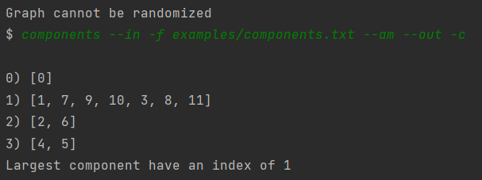
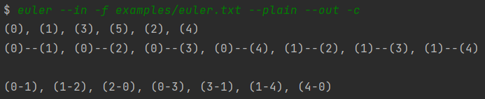
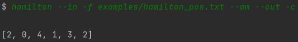
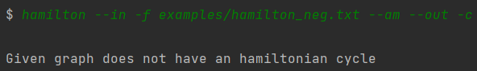

## Projekt 2

Poniżej znajduje się spis dostępnych operacji wraz z obsługiwanymi dla nich parametrami. Dodatkowo zamieszczone zostały przykładowe wywołania operacji oraz screen shoty wyników.

Do większości zadań pliki można dowolnie edytować i eksperymentować, byleby zgadzały się w nich typy wprowadzanych danych.
Wynikowe reprezentacje grafów można obejrzeć za pomocą Projektu 1 - [Instrukcja uruchomienia](https://github.com/Fadikk367/Grafy-2021/blob/main/LAB1/README.md)

### 1. sequence

data_source: -c, --console

data_type: --gseq

data_destination: -c, --console, -f, --file

Dla operacji:
```
sequence --in -c --gseq --out -c
```

po wprowadzeniu sekwencji: 

``` 
Enter sequence number:
5 5 4 3 2 2 1 
``` 

otrzymamy wynik:

```
 0   1   1   1   1   1   0
 1   0   1   1   1   1   0
 1   1   0   1   0   0   1
 1   1   1   0   0   0   0
 1   1   0   0   0   0   0
 1   1   0   0   0   0   0
 0   0   1   0   0   0   0

```


### 2. randomize

args: liczba permutacji

data_source: -f, --file

data_type: --am

data_destination: -c, --console, -f, --file

Dla operacji:
```
$ randomize 1 --in -c --gseq --out -c
```

po wprowadzeniu sekwencji: 
```
Enter number sequence:
3 3 3 3 3 3 3 3
```
otrzymamy wynik:

```
 0   1   0   1   0   0   0   1
 1   0   1   1   0   0   0   0
 0   1   0   1   0   1   0   0
 1   1   1   0   0   0   0   0
 0   0   0   0   0   1   1   1
 0   0   1   0   1   0   1   0
 0   0   0   0   1   1   0   1
 1   0   0   0   1   0   1   0
```

Dla grafu pełnego:
```
randomize 100 --in -f examples/full_graph.txt --am --out -c
```

```
Graph cannot be randomized
$
```


### 3. components

data_source: -f, --file

data_type: --am

data_destination: -c, --console, -f, --file

Dla operacji:
```
components --in -f examples/components.txt --am --out -c
```




### 4. euler

data_source: -f, --file

data_type: --plain

data_destination: -c, --console, -f, --file

Dla operacji:
```
euler --in -f examples/euler.txt --plain --out -c
```
gdzie plik examples/euler.txt zawiera "6" - liczbę wierzchołków,



mamy wypisaną listę wierzchołków, listę krawędzi oraz jak wygląda znaleziony cykl Eulera.


### 5. k_regular

data_source: -f, --file

data_type: --plain

data_destination: -c, --console, -f, --file

Dla operacji:
```
k_regular --in -f examples/regular.txt --plain --out -c
```
gdzie plik examples/regular.txt zawiera "12 4" - liczbę wierzchołków oraz ich stopień,

otrzymamy wynik:
```
 0   1   0   0   0   0   0   1   1   0   1   1
 1   0   0   1   0   1   1   0   1   0   0   0
 0   0   0   1   0   0   1   0   1   1   1   0
 0   1   1   0   1   0   0   0   0   1   0   1
 0   0   0   1   0   1   1   0   0   1   0   1
 0   1   0   0   1   0   0   1   0   1   1   0
 0   1   1   0   1   0   0   1   1   0   0   0
 1   0   0   0   0   1   1   0   0   0   1   1
 1   1   1   0   0   0   1   0   0   0   0   1
 0   0   1   1   1   1   0   0   0   0   1   0
 1   0   1   0   0   1   0   1   0   1   0   0
 1   0   0   1   1   0   0   1   1   0   0   0

```


### 6. hamilton

data_source: -f, --file

data_type: --am

data_destination: -c, --console, -f, --file

Dla operacji:
```
hamilton --in -f examples/hamilton_pos.txt --am --out -c
```
gdzie plik examples/hamilton_pos.txt zawiera graf hamiltonowski,



dostajemy przykładową informację, jak przebiega przykładowy cykl Hamiltona.
Natomiast dla operacji:
```
hamilton --in -f examples/hamilton_neg.txt --am --out -c
```
gdzie plik examples/hamilton_neg.txt nie zawiera grafu hamiltonowskiego, otrzymujemy stosowną informację:


