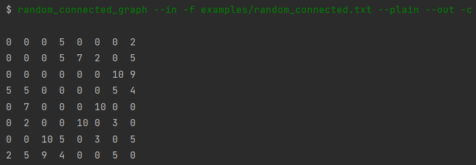
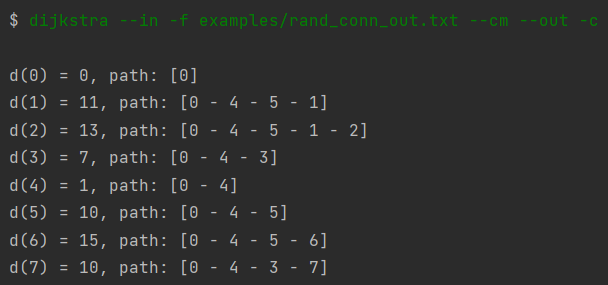
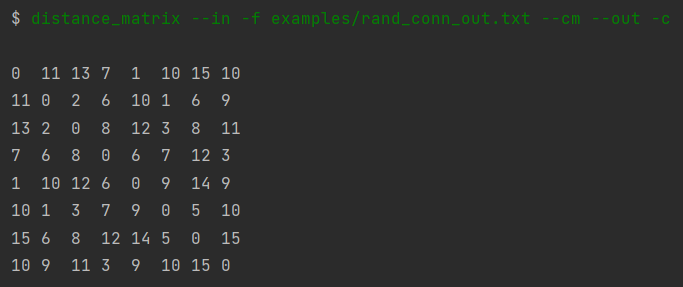
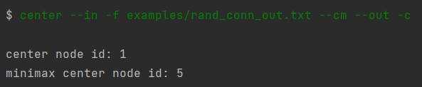
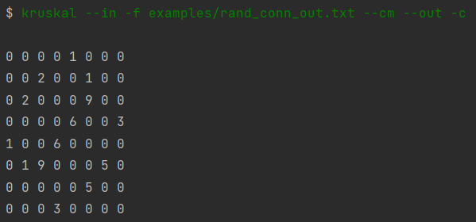

## Projekt 3

Poniżej znajduje się spis dostępnych operacji wraz z obsługiwanymi dla nich parametrami. Dodatkowo zamieszczone zostały przykładowe wywołania operacji oraz screen shoty wyników.

Do większości zadań pliki można dowolnie edytować i eksperymentować, byleby zgadzały się w nich typy wprowadzanych danych.

Wynikowe reprezentacje grafów można na ten moment obejrzeć za pomocą strony [GraphOnline](graphonline.ru/en/).

### 1. random_connected_graph

data_source: -f, --file

data_type: --plain

data_destination: -c, --console, -f, --file

Dla operacji:
```
random_connected_graph --in -f examples/random_connected.txt --plain --out -c
```

gdzie examples/random_connected.txt zawiera ```8 0.4``` (ilość wierzchołków i prawdopodobieństwo wystąpienia krawędzi), po nadaniu losowych wag otrzymamy wynik:



Na potrzeby kolejnych zadań (2-5) utworzyliśmy również nowy graf i zapisaliśmy go w pliku przy pomocy operacji:
```
random_connected_graph --in -f examples/random_connected.txt --plain --out -f examples/rand_conn_out.txt
```

### 2. dijkstra

data_source: -f, --file

data_type: --cm

data_destination: -c, --console, -f, --file

Dla operacji:
```
dijkstra --in -f examples/rand_conn_out.txt --cm --out -c
```



Zgodnie z zaproponowanym przykładowym wyjściem programu z pdf, Wypisujemy kolejno: wierzchołek, długość najdłuższej ścieżki oraz path, czyli kolejno wierzchołki, przez które przechodzimy.


### 3. distance_matrix

data_source: -f, --file

data_type: --cm

data_destination: -c, --console, -f, --file

Dla operacji:
```
distance_matrix --in -f examples/rand_conn_out.txt --cm --out -c
```




### 4. center

data_source: -f, --file

data_type: --cm

data_destination: -c, --console, -f, --file

Dla operacji:
```
center --in -f examples/rand_conn_out.txt --cm --out -c
```



mamy wypisane centrum grafu ```center node id``` oraz centrum minimax ```minimax center node id```.


### 5. kruskal

data_source: -f, --file

data_type: --cm

data_destination: -c, --console, -f, --file

Dla operacji:
```
kruskal --in -f examples/rand_conn_out.txt --cm --out -c
```



otrzymujemy minimalne drzewo rozpinające przy pomocy algorytmu Kruskala.
