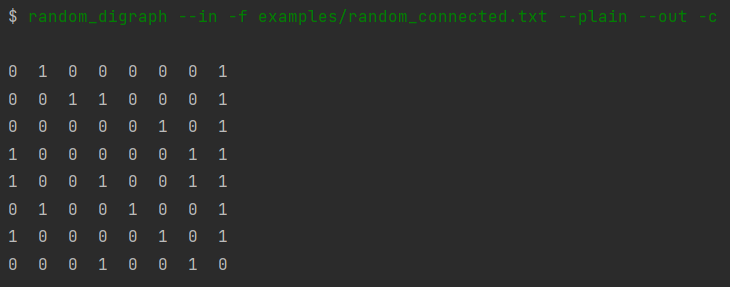
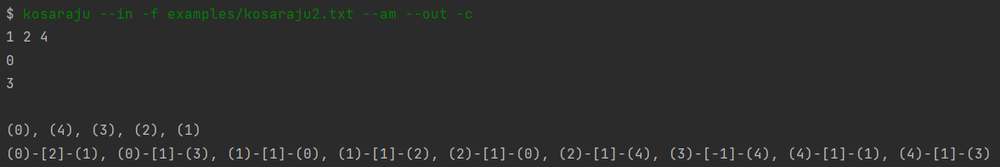
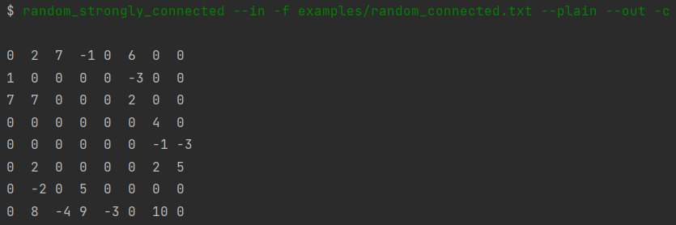

## Projekt 4

Poniżej znajduje się spis dostępnych operacji wraz z obsługiwanymi dla nich parametrami. Dodatkowo zamieszczone zostały przykładowe wywołania operacji oraz screen shoty wyników.

Do większości zadań pliki można dowolnie edytować i eksperymentować, byleby zgadzały się w nich typy wprowadzanych danych.

Wynikowe reprezentacje grafów można na ten moment obejrzeć za pomocą strony [GraphOnline](graphonline.ru/en/).

### 1. random_digraph

data_source: -f, --file

data_type: --plain

data_destination: -c, --console, -f, --file

Dla operacji:
```
random_digraph --in -f examples/random_connected.txt --plain --out -c
```

gdzie examples/random_connected.txt zawiera ```8 0.4``` (ilość wierzchołków i prawdopodobieństwo wystąpienia krawędzi), otrzymamy wynik:




### 2. kosaraju

data_source: -f, --file

data_type: --am

data_destination: -c, --console, -f, --file

Dla operacji:
```
kosaraju --in -f examples/kosaraju.txt --am --out -c
```


Dla danego prostego przykładu otrzymamy graf silnie spójny. Mamy wypisaną jedną składową z wierzchołkami i krawędziami z wagami (tutaj wszystkie wynoszą 1).

Natomiast dla operacji:
```
kosaraju --in -f examples/kosaraju2.txt --am --out -c
```



Mamy więcej składowych. Również wypisane są po kolei składowe grafu oraz krawędzie między wierzchołkami wraz z ich wagami.


### 3. random_strongly_connected

data_source: -f, --file

data_type: --plain

data_destination: -c, --console, -f, --file

Dla operacji:
```
random_strongly_connected --in -f examples/random_connected.txt --plain --out -c
```
gdzie examples/random_connected.txt zawiera ```8 0.4``` (ilość wierzchołków i prawdopodobieństwo wystąpienia krawędzi), otrzymamy wynik:



Otrzymujemy podany losowy silnie spójny digraf.
