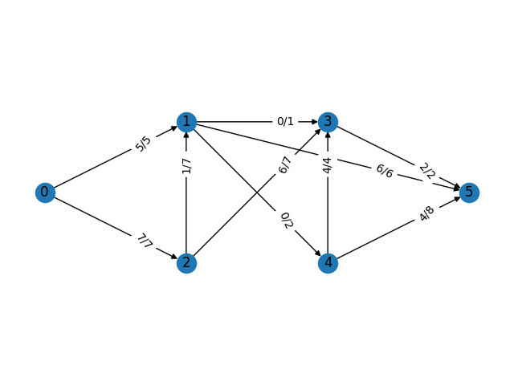

## Projekt 5

UWAGA!
> Należy zainstalować zależności wymienione w pliku requirements.txt

### 1. generate_network

data_source: -f, --file

data_type: --plain

data_destination: -c, --console, -f, --file

Przykład:
```
$ generate_network --in -f examples/network.txt --plain --out -c

(0)-->(1) flow: 5 cap: 5
(0)-->(2) flow: 7 cap: 7
(1)-->(4) flow: 0 cap: 2
(2)-->(3) flow: 6 cap: 7
(3)-->(5) flow: 2 cap: 2
(4)-->(5) flow: 4 cap: 8
(1)-->(5) flow: 6 cap: 6
(4)-->(3) flow: 4 cap: 4
(2)-->(1) flow: 1 cap: 7
(1)-->(3) flow: 0 cap: 1

```

gdzie examples/network.txt zawiera ```2``` (liczba pośrednich warstw).

Dodatkowo w pliku graph.png wygenerowana zostanie grafika przedstawiająca naszą sieć wraz z zaznaczonymi przepływami oraz pojemnościami.





> Mamy świadomość, że algorytm nie do końca działa poprawnie (przepływy wsteczne oraz te w obrębie tej samej warstwy). Niestety nie udało nam się znaleźć przyczyny tych nieprawidłowości. Niemniej jednak samo generowanie sieci oraz jej prezentacja są jak najbardziej sprawne.