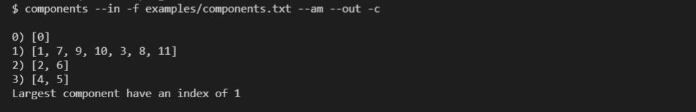

# Grafy-2021

## Projekt 1

LAB1 - [Instrukcja uruchomienia](https://github.com/Fadikk367/Grafy-2021/blob/main/LAB1/README.md)  

## Projekty 2-4

W interakcję z programem wchodzimy za pomocą interfejsu konsolowego. 

Uruchomienie:
```
$ python main.py
```

> Wymagana wersja pythona: 3.8+.

> Brak potrzeby instalowania dodatkowych dependencji.

Graficzną reprezentację grafów można obejrzeć za pomocą aplikacji z projektu nr 1. Instrukcja uruchamiania znajduje się w pliku README w katalogu LAB1

Ogólna postać komend wygląda następująco:

```
$ <operacja> <args> --in <data_source> <(?)filename> <data type> --out <data_destination>
```
gdzie:

* **operacja** to dostępna funkcja aplikacji (czyli zadanie z projektu)
* **args** argumenty, któe zostaną przekazane bezpośrednio do resolvera (funkcji przyjmującej wczytane dane, wywołującej odpowiednią metodą algorytmu oraz zwracajacej rezultat)
* **--in** to flaga która oznacza rozpoczącie ciagu argumentó dotyczących wejścia programu
* **data_source** rodzaj wejścia, którego będą brane dane, mogą to być np:
  * -f/--file => dane wejściowe branę będą z pliku (dla tego wejścia kolejnym oczekiwanym argumentem jest naturalnie ścieżka do konkretnego pliku)
  * -c/--console => dane oczekiwane będą na konsoli
* **filename** argument wprowadzany tylko jeśli źródłem danych jest plik, oznacza naturalnie ścieżkę do pliku z danymi
* **data_type** typ danych wejścowych:
  * --am => macierz sąsiedztwa
  * --im => macierz incydencji
  * --al => lista sąsiedztwa
  * --gseq => ciąg graficzny
  * --plain => dane surowe, nie będą w żadnej sposób przetwarzane ani transformowane, w tym przypadku funkcje resolvera odpowiada za wyłuskanie z nich informacji
* **--out** flaga oznaczająca jednocześnie koniec parametrów wejścia oraz początek parametrów wyjścia
* **data_destination** rodzaj wyjścia, do którego będą przekierowane dane wyjściowe, mogą to być analogicznie jak dla data_source:
  * -f/--file => dane wyjściowe zapisane zostaną w pliku (dla tej flagi kolejnym oczekiwanym argumentem jest naturalnie ścieżka z nazwą pliku)
  * -c/--console => rezultat programu wypisany zostanie na konsoli
  * -i/--img => wyjście zaprezentowane zostanei w postaci graficznej (TODO) 


Dodatkowo dostępne są dwie komendy pomocnicze:
* help => listuje dostępne w programie operacje
* exit => kończy działanie programu
* help <nazwa_operacji> => listuje dostępne zródła i typy danych wejściowych oraz możliwości wyjścia dla konkretnej operacji (TODO)


> ### UWAGA
> Nie wszystkie zródła oraz typy danych są dostępne dla wszytskich operacji, dostępnośc jest uwarunkowana przez opcje wprowadzone w momencie instancjonowania klasy OperationStrategy i definiowana jest przez programistę w oparciu o specyfikę zadania, dostępne reprezentacje danych oraz odpowiednie readery/printery.

## Przykłady (v1.0.0)

Poniżej znajduje się spis aktualnie dostępnych operacji wraz z obsługiwanymi dla nich parametrami. Dodatkowo zamieszczone zostały screen shoty z przykłądami ich użycia.

### 1. sequence

data_source: -c, --console

data_type: --gseq

data_destination: -c, --console, -f, --file


### 2. randomize

args: liczba permutacji

data_source: -f, --file

data_type: --am

data_destination: -c, --console, -f, --file


Dla grafu pełnego:


### 3. components

data_source: -f, --file

data_type: --am

data_destination: -c, --console, -f, --file



### 4. euler

data_source: -f, --file

data_type: --plain

data_destination: -c, --console, -f, --file


Dla zawartości pliku examples/euler.txt: "6"

### 5. k_regular

data_source: -f, --file

data_type: --plain

data_destination: -c, --console, -f, --file


Zawartość pliku examples/k_regular_out.txt:


Dla zawartości pliku examples/k_regular.txt: "12 4"
- 12 - wierzchołków
- 4 - stopień wierzchołków


### 6. hamilton

data_source: -f, --file

data_type: --am

data_destination: -c, --console, -f, --file


